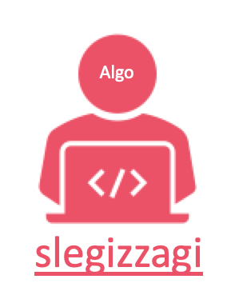

# Slegizzagi 알고리즘 Repository

  

## 참가자
* [전상규](./SangKyu%20Jeon/README.md)
* [feather](./feather/README.md)
* [doyoon](./doyoon/README.md)
* [gayoung](./gayoung/README.md)

### 작성시 Tip 

### BOJNumberOfProblem

- 내가 이해한 문제내용

  - ..

- 접근 방식

  - ..

- 어려웠던 점

  - ..
  
  
- 복잡도

  - 시간복잡도:    
  - ex) O(n^2) O(nlogn)
